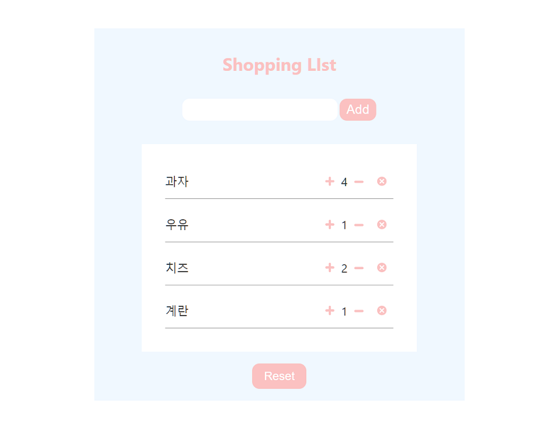

# Shopping List

  #### 개발환경💻  

   </a>
    </a>
    </a> 
  #### 프로젝트 소개 💬  
    리액트의 클래스형컴포넌트로 코딩한 간단하게 쇼핑목록을 만드는 프로젝트입니다. 
    이름을 입력하여 리스트에 올릴 수 있으며, 리스트에서 개별로 갯수 조절을 하거나 삭제가 가능합니다.   
    리셋버튼을 클릭하면 리스트를 전부 지울 수가 있습니다.
    

    
